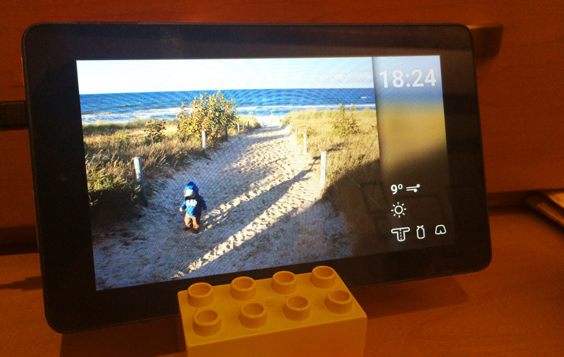

# Wetterbild



This is a digital picture frame which includes a weather station (a.k.a. my first Android project).
Depending on the weather screen also shows what I have to wear for running.

**Please note**:
This project is for my personal use (Hence, the minimal documentation and lack of refactoring ;) ).
You can steal whatever you want, but this is not something I would publish on the app store (e.g., changing the city requires intervention in the code).

## Installation

Make sure Vagrant is `>= 1.7.x` and make sure VirtualBox is `>= 5.0.12`.

I am using Vagrant for compiling the app. To start the machine go into your project folder and run: `vagrant up`.
All following commands assume that you are inside the Vagrant machine. Hop into it by calling `vagrant ssh` in your project folder.
To shutdown the machine run `vagrant halt` and bring it up again with `vagrant up`.

Before doing anything you need [Java](http://www.oracle.com/technetwork/java/javase/downloads/jdk7-downloads-1880260.html):

```bash
sudo add-apt-repository -y ppa:webupd8team/java
sudo apt-get update
sudo apt-get install oracle-java8-installer
sudo apt-get install oracle-java8-set-default
```

After the machine was up for the first time. Shut it down again (`vargant halt`) and go into the VirtualBox settings of the new machine.
Add a USB Controller and add a filter for your Kindle Fire device (connect it before).

Then add `PATH="/home/vagrant/Android/Sdk/platform-tools:/home/vagrant/Android/Sdk/tools"` to your `.profile`.
Also, add the paths to `secure_path` in `/etc/sudoers`.

If you want to start the package manager for the SDK, please do the following in the **GUI window of the machine**:

```bash
# use the VirtualBox window of your machine
# login with vagrant : vagrant
startx
# open a terminal
android
```

Install the following packages:

```txt
Android SDK Tools: 24.4.1
Android SDK Platform-tools: 23.1
Android SDK Build-tools: 23.0.2
SDK Platform: 22 (rev. 2)
Android Support Repository: 25
```

## Customize and API keys

Please get a new API key for [openweathermap.org](http://www.openweathermap.org).
Then copy the file `Custom.java.template` to `Custom.java` (in `wetterbild/src/main/java/de/motine/wetterbild/`).
Put the key in and change the city.

You can also change the folder from which to import images in `Custom.java`.

## Compile & start

If you have a Mac and _Android File Transfer_ installed, go into _Activity Monitor_ and kill the _Android File Transfer Agent_.
After restarting the machine, **you have to make sure to stop the adb server and then restart it as root every time you reboot!**

```bash
adb kill-server
sudo adb kill-server
sudo adb start-server
sudo adb devices
```

**Also, make sure your Internet connection works.**

Then you can go ahead and build and install:

```bash
./gradlew assembleDebug # builds
./gradlew installDebug # builds and installs
./gradlew clean # remove build files

# you can check: adb devices
# install manually: adb -d install -r build/apk/wetterbild-debug-unaligned.apk
# or uninstall manually: adb -d uninstall de.motine.wetterbild

# show device logs
adb logcat # show everything
adb logcat *:W # show only warnings
```

## Other stuff

If you encounter something like `insufficient privileges`, then please restart the adb server as described above.

```bash
rm -rf /home/vagrant/.gradle/caches # If the build takes ages and then fails due to some time out.
# create new project
android create project -g -v 0.10.+ --target android-22 --name wetterbild --path /vagrant/wetterbild --activity MainActivity --package de.motine.wetterbild
```

### Time sheet

The whole thing came down during X-mas 2015.

```text
Design: 3h
Android Setup: 4h
Programming: 2h + 1h + 2h + 1h + 2h + 3h + 1h + 2h + 2h + 1h + 2h
```
